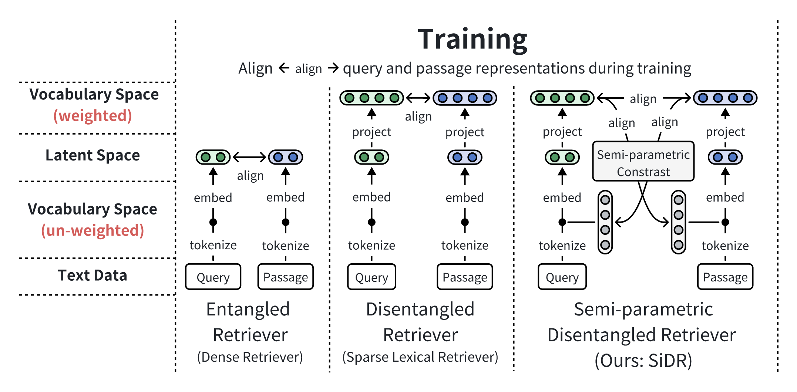
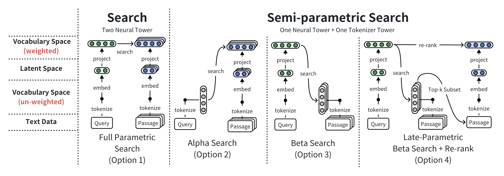
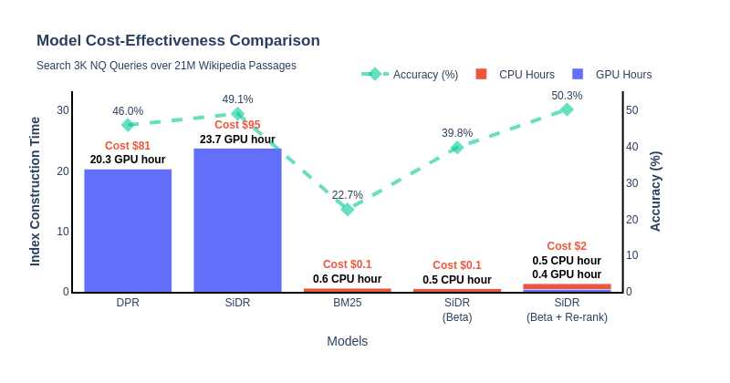

# SiDR: Semi-Parametric Retrieval via Binary Bag-of-Tokens Index


<p align="center">
  
</p>

## Installation
```
# install poetry first
# curl -sSL https://install.python-poetry.org | python3 -
poetry install
poetry shell
```

## Data

Download data using identifiers in `conf/data_stores/*.yaml`.

```bash
# Download a single dataset file
python download.py nq_train
# Download multiple dataset files:
python download.py nq_train trivia_train
# Download all dataset files:
python download.py all
```

## Quick Start
```python
# query: str or List[str]
# passages: List[str]
import torch
from src.ir import Retriever

query = "Who first proposed the theory of relativity?"
passages = [
    "Albert Einstein (14 March 1879 – 18 April 1955) was a German-born theoretical physicist who is widely held to be one of the greatest and most influential scientists of all time. He is best known for developing the theory of relativity.",
    "Sir Isaac Newton FRS (25 December 1642 – 20 March 1727) was an English polymath active as a mathematician, physicist, astronomer, alchemist, theologian, and author who was described in his time as a natural philosopher.",
    "Nikola Tesla (10 July 1856 – 7 January 1943) was a Serbian-American inventor, electrical engineer, mechanical engineer, and futurist. He is known for his contributions to the design of the modern alternating current (AC) electricity supply system."
]

# Load retriever
ir = Retriever.from_pretrained("jzhoubu/sidr-nq") # sidr-nq (train on NQ) or sidr-ms (train on MSMARCO)
ir = ir.to("cuda")

# Embed query and passages
q_emb = ir.encoder_q.embed(query)  # Shape: [1, V]
p_emb = ir.encoder_p.embed(passages)  # Shape: [4, V]

# Relevance
scores = q_emb @ p_emb.t()
print(scores)

# Output: 
# tensor([[97.2964, 39.7844, 37.6955]], device='cuda:0')
```


## Build Index (for large-scale search)

```python
ir.build_index(passages, index_type="sparse") # sparse embedding-based index
print(ir.index)

# Output:
# Index Type      : SparseIndex
# Vector Shape    : torch.Size([3, 29523])
# Vector Dtype    : torch.float32
# Vector Layout   : torch.sparse_csr
# Number of Texts : 3
# Vector Device   : cuda:0

ir.build_index(passages, index_type="bag_of_token") # bag-of-tokens index
print(ir.index)

# Output:
# Index Type      : BoTIndex
# Vector Shape    : torch.Size([3, 29523])
# Vector Dtype    : torch.float16
# Vector Layout   : torch.sparse_csr
# Number of Texts : 3
# Vector Device   : cuda:0


# Save index
index_file = "/path/to/index.npz"
ir.save_index(path)

# Load index
index_file = "/path/to/index.npz"
data_file = "/path/to/texts.jsonl"
ir.load_index(index_file=index_file, data_file=data_file)
```

## Search on Index

<p align="center">
  


</p>

### 1. Conventional Search (Embedded Query Search Embedded Passages)
```python
# Large-scale search on index
index_file=/path/to/embedding_based_index
ir.load_index(index_file=index_file, data_file=data_file)

queries = [query]
results = ir.retrieve(queries, k=3)
print(results)

# Output:
# SearchResults(
#   ids=tensor([[0, 1, 2]], device='cuda:0'),
#   scores=tensor([[97.2458, 39.7507, 37.6407]], device='cuda:0')
# )

# Get raw passage
query_id = 0
top1_psg_id = results.ids[query_id][0]
top1_psg = ir.index.get_sample(top1_psg_id)
print(top1_psg)

# Output:
# Albert Einstein (14 March 1879 – 18 April 1955) was a German-born theoretical physicist who is widely held to be one of the greatest and most influential scientists of all time. He is best known for developing the theory of relativity.
```

### 2. Beta Search (Embedded Query Search Tokenized Passages)
```python
# Small-scale beta search
q_emb = svdr.encoder_q.embed(query)
p_bin = svdr.encoder_p.embed(passages, bow=True)
scores = q_emb @ p_bin.t()
```

```python
# Large-scale search on index
index_file=/path/to/bag_of_tokens_index
ir.load_index(index_file=index_file, data_file=data_file)

# Beta search
queries = [query]
beta_results = ir.retrieve(queries, k=3)

# Beta search + Re-rank (late parametric)
queries = [query]
beta_rerank_results = ir.retrieve(queries, k=3, rerank=True)
print(beta_rerank_results)

# Output:
# SearchResults(
#   ids=tensor([0, 2, 1], device='cuda:3'), 
#   scores=tensor([97.2964, 39.7844, 37.6955], device='cuda:0')
# )
```

<!--
## 👾 Training
We are testing on `python==3.9` and `torch==2.2.1`. Configuration is handled through `hydra==1.3.2`.

```bash
EXPERIMENT_NAME=test
python -m torch.distributed.launch --nnodes=1 --nproc_per_node=4 train_vdr.py \
hydra.run.dir=./experiments/${EXPERIMENT_NAME}/train \
train=vdr_nq \
data_stores=wiki21m \
train_datasets=[nq_train]
```
- `--hydra.run.dir`: Directory where training logs and outputs will be saved
- `--train`: Identifier for the training config,  in `conf/train/*.yaml`.
- `--data_stores`: Identifier for the datastore, in `conf/data_stores/*.yaml`.
- `--train_datasets`: List of identifiers for the training datasets to be used, in `data_stores`

During training, we display `InfoCard` to monitor the training progress. 

> [!TIP]
> <details><summary>What is <b><span style="color: blue;">InfoCard</span></b>?</summary>
>
> `InfoCard` is a organized log generated during the training that helps us visually track the progress.  
> 
> An `InfoCard` looks like this:
>
> 
> 
> **InfoCard Layout**
> 
> 1. Global Variables (`V(q)`, `V(p)`, etc.):
>    - Shape: Displays the dimensions of the variable matrix.
>    - Gate: Indicates the sparsity by showing the ratio of non-zero activations.
>    - Mean, Max, Min: Statistical measures of the data distribution within the variable.
> 
> 2. `EXAMPLE` Section:
>    - Contains one sample from the training batch, including query text (`Q_TEXT`), positive passages (`P_TEXT1`), negative passage (`P_TEXT2`), and the correct answer (`ANSWER`).
> 
> 3. Token Triple Sections (`V(q)`, `V(p)`, `V(p_neg)`, `V(q) * V(p)`), which provided token-level impact:
>    - Token (`t`): The specific vocabulary token.
>    - Query Rank (`qrank`): Rank of the token in the query representation.
>    - Passage Rank (`prank`): Rank of the token in the passage representation.
> </details>


## 🎮 Inference (Large-scale Retrieval)

For dense retrieval (DPR) inference, please see detailed documentation [here](examples/inference_dense/README.md).

---

For sparse retrieval (VDR) inference, please see detailed documentation [here](examples/inference_sparse/README.md).

---

For semi-parametric retrieval (SVDR) inference, see below:

### 1. Build a Binary Token Index
To construct a binary token index for text corpus:
```bash
python -m inference.build_index.binary_token_index \
        --text_file="path/to/your/corpus_file.jsonl" \
        --save_file="path/to/your/output_index.npz" \
        --batch_size=32 \
        --num_shift=999 \
        --max_len=256
```
Parameters:
- `--text_file`: Path to the corpus file to be indexed (`.jsonl` format).
- `--save_file`: Path where the index file will be saved (`.npz` format).
- `--batch_size`: Batch size for processing.
- `--num_shift`: Allows for shifting the vocabulary token IDs by a specified amount.
- `--max_len`: Maximum length for tokenization of the documents. 


### 2. Beta Search on Binary Token Index
```bash
python -m inference.search.beta_search \
        --checkpoint=vsearch/vdr-nq \
        --query_file="path/to/your/query_file.jsonl" \
        --text_file="path/to/your/corpus_file.jsonl" \
        --index_file="path/to/your/index_file.npz" \
        --save_file="path/to/your/search_result.json"  \
        --device=cuda
```
Parameters:
- `--query_file`: Path to file containing questions, with each question as a separate line (`.jsonl` format). 
- `--text_file`: Path to the corpus file (`.jsonl` format).
- `--index_file`: Path to pre-computed index file (`.npz` format).
- `--save_file`: Path where the search results will be stored (`.json` format).
- `--batch_size`: Number of queries per batch.
- `--num_rerank`: Number of passages to re-rank.

### 3. Scoring on Wiki21m benchmark
```bash
python -m inference.score.eval_wiki21m \
        --text_file="path/to/your/corpus_file.jsonl" \
        --result_file="path/to/your/search_result.json" \
        --qa_file="path/to/your/dpr_qa_file.csv"
```
Parameters:
- `--text_file`: Path to the corpus file (`.jsonl` format).
- `--result_file`: Path to search results (`.json` format).
- `--qa_file`: Path to DPR-provided qa file (`.csv` format)
-->

## Citation
If you find this repository useful, please consider giving ⭐ and citing our paper:
```
@inproceedings{zhousemi,
  title={Semi-Parametric Retrieval via Binary Bag-of-Tokens Index},
  author={Zhou, Jiawei and Dong, Li and Wei, Furu and Chen, Lei},
  booktitle={The Thirteenth International Conference on Learning Representations}
}
```